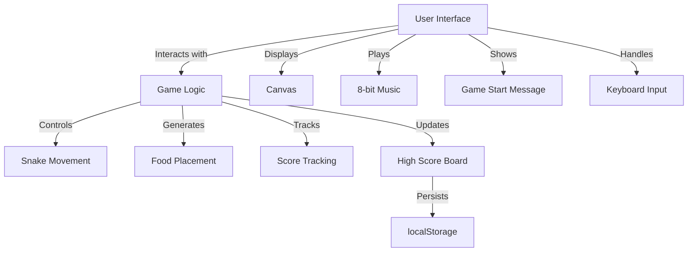

# Classic Snake Game

## Overview
This project implements a classic snake game using HTML, CSS, and JavaScript. The game features a movable snake, food items represented by emojis, and a high score board. This game was created as an experiment to explore the capabilities of GitHub Copilot running in Agent mode, utilizing GPT-4o for enhanced coding assistance and automation within Visual Studio Code. 

## Features
- **Snake Movement**: Controlled using arrow keys.
- **Food Items**: Randomly placed food emojis that change each time.
- **Snake Growth**: The snake grows longer when it eats food.
- **Score Tracking**: Displays the current score during gameplay.
- **High Score Board**: Maintains the top 3 scores with gold, silver, and bronze medals.
- **Persistent High Scores**: High scores are saved using `localStorage`.
- **Game Start Message**: Displays a prompt to press an arrow key to start.
- **Smiley Face on Snake Head**: The snake head features a smiley face.
- **Rounded Snake Body**: The snake body is drawn as rounded rectangles.
- **8-bit Music**: Plays classic 8-bit music during gameplay, controllable with a toggle button.

## Music Credit
Music from #Uppbeat (free for Creators!):

https://uppbeat.io/t/kevin-macleod/bit-shift

License code: ITM4WUP6D36GMJWZ

## How to Play
1. Open the `index.html` file in a browser.
2. Press an arrow key to start the game.
3. Use the arrow keys to control the snake.
4. Eat food to grow the snake and increase your score.
5. Avoid collisions with the walls or the snake's own body.

### Updated Mobile Instructions
- Use the arrow keys or touch gestures to control the snake.
- Swipe up, down, left, or right within the touch area to move the snake.
- The touch area is located just below the game canvas.
- The game starts automatically when you touch the screen.
- High scores are displayed below the touch area for easy access.

### Play Online
You can play the game directly in your browser by visiting:  
[Classic Browser Snake Game](https://bmfoste.github.io/Classic-Browser-Snake-Game/)

## Development
### Setup
1. Clone the repository.
2. Run `npm install` to install dependencies.

### Testing
Run the unit tests using:
```bash
npm test
```

### Files
- `index.html`: The main HTML file.
- `styles.css`: Contains the styling for the game.
- `script.js`: Implements the game logic.
- `tests/script.test.js`: Unit tests for the game logic.
- `assets/bit-shift-kevin-macleod-main-version-24901-03-12.mp3`: 8-bit music file.



## Future Enhancements
- Add special effects.
- Implement levels with increasing difficulty.
- Add multiplayer support.

## License
This project is licensed under the MIT License.

## Best Practices for Prompting in Software Engineering

When using tools like GitHub Copilot or other AI-powered assistants, crafting effective prompts is key to achieving optimal results. Here are some best practices for prompting in software engineering:

1. **Be Specific**: Clearly define the task or functionality you want to implement. Avoid vague or ambiguous prompts.
   - Example: "Create a function to calculate the factorial of a number using recursion."

2. **Provide Context**: Include relevant details about the project or the problem you're solving.
   - Example: "In a snake game, implement collision detection logic to end the game when the snake hits the wall or itself."

3. **Break Down Complex Tasks**: Divide large tasks into smaller, manageable steps.
   - Example: Instead of asking for "Build a complete snake game," start with "Create the HTML structure for the game canvas."

4. **Use Examples**: Provide sample inputs and expected outputs to clarify your requirements.
   - Example: "Write a function that takes an array of numbers and returns the sum. For example, input [1, 2, 3] should return 6."

5. **Iterate and Refine**: Review the generated code and refine your prompts as needed to improve the results.
   - Example: If the initial prompt generates incomplete code, follow up with "Add error handling to the function."

6. **Ask for Documentation**: Request comments or explanations to ensure the code is well-documented and easy to understand.
   - Example: "Generate a function to sort an array and include comments explaining each step."

7. **Test the Code**: Always test the generated code to ensure it works as expected and meets your requirements.

By following these best practices, you can effectively leverage AI tools to enhance your software engineering workflows and achieve better outcomes.

## Using GitHub Copilot to Generate the Game

GitHub Copilot can assist in generating the Classic Snake Game by providing code suggestions and completing functions based on your prompts. Below is a history of chat prompts and responses that guided the development of this project:

### Prompts and Responses
1. **Prompt**: "What is the classic snake game and what are the features that make it work? Describe in detail."
   - **Response**: The classic snake game is a simple arcade game where the player controls a snake that moves around the screen, eating food to grow longer. Key features include:
     - **Snake Movement**: The snake moves in a grid-like fashion, controlled by arrow keys.
     - **Food Items**: Randomly placed food that the snake eats to grow longer.
     - **Collision Detection**: The game ends if the snake collides with itself or the walls.
     - **Score Tracking**: Tracks the player's score based on the number of food items eaten.
     - **High Score Board**: Displays the top scores.
     - **Persistent Storage**: High scores are saved using localStorage.

2. **Prompt**: "I'm an engineer, and I want to build a classic snake game as described using simple HTML, JavaScript, and CSS so I can easily play in a web browser. I also want to make sure the code is well documented, testable, and has appropriate unit testing coverage for maintainability."
   - **Response**: GitHub Copilot suggested creating a basic HTML structure with a canvas element for the game, implementing the game logic in JavaScript, and styling the game using CSS. It also recommended adding comments to document the code, writing unit tests for key functions, and using localStorage for persistent high scores.

3. **Prompt**: "Create a basic HTML structure for a snake game."
   - **Response**: GitHub Copilot generated the `index.html` file with a canvas element for the game.

4. **Prompt**: "Implement snake movement logic in JavaScript."
   - **Response**: Copilot suggested functions to control the snake's movement using arrow keys.

5. **Prompt**: "Add a high score board using localStorage."
   - **Response**: Copilot provided code to save and retrieve high scores from `localStorage`.

6. **Prompt**: "Style the game using CSS."
   - **Response**: Copilot generated CSS rules for the canvas and high score board.

7. **Prompt**: "Include 8-bit music in the game."
   - **Response**: Copilot suggested using an audio element to play the music file.

8. **Prompt**: "Write unit tests for the game logic."
   - **Response**: Copilot created test cases for the snake movement and collision detection.

### Recommendations
- Use clear and concise prompts to guide Copilot.
- Review and test the generated code to ensure it meets your requirements.
- Combine Copilot's suggestions with your own logic for optimal results.
